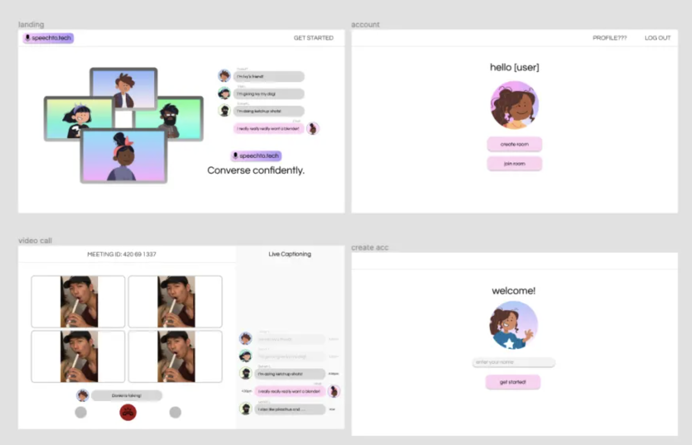

# User Page

I am a second year Computer Science undergraduate from the University of California, San Diego.

Click to go to individual projects:
- [speechto.text](speechto.text)
- [Cardiac Atlas Database](cardiac-atlas-database)

## Projects

### speechto.text



(Image can also be found [here](./speechtotech.png))

> speechto.text is a video conferencing web application that captions the conversation in the form of text messages. The user will enter their name, create/join a meeting, and speak into their mic to see their words displayed on the right. This allows the user to keep track of who is speaking, as well as read the captions at their own pace rather than the captions disappearing as the speaker continues to talk.

The **devpost** can be found [here](https://devpost.com/software/speechto-tech).

### Cardiac Atlas Database

> The Cardiac Atlas Database is a database project with a web application that interfaces with heart DICOMs. This is primarily for the use of researchers.

Use the following code snippet in command line to set up the project once it has been cloned.

```
gradle clean
```

Task list for the Cardiac Atlas Database for incoming quarter:
- [x] fix file uploads
- debug the DICOM pages
- look into zipped uploads